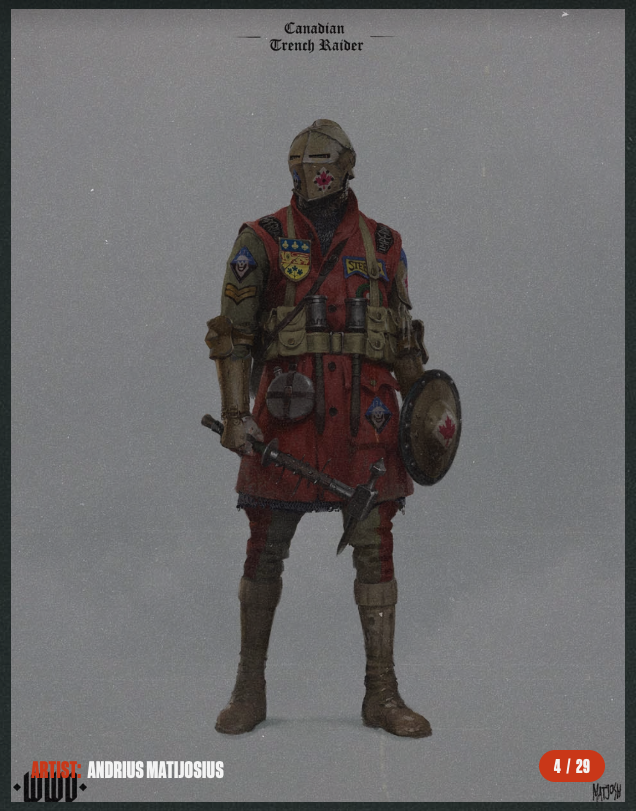
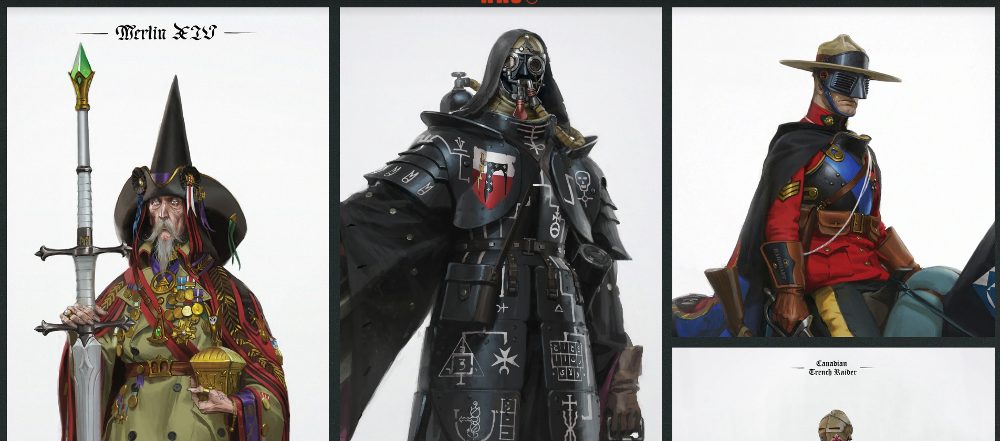

# Reference Material

Sites and works Ian has selected that achieve the feeling this site should have.
Design agents study these BEFORE proposing anything, and cite which reference informed
each significant decision. References are direction, not templates — steal principles,
never layouts wholesale.

## How to fill this in (Ian)

For each reference, note what to TAKE (the specific thing it does well) and what to
LEAVE (what doesn't fit this site). Specificity is what makes this useful to agents:
"the way nav stays out of the way until you need it" beats "it looks clean".
3-6 references is the sweet spot.

Screenshots are encouraged — they survive site redesigns and outages, and agents can
view image files directly. Drop them in `design/references/` and embed in an entry
with markdown image syntax:

```markdown

```

Name files descriptively (`site-nav-collapsed.png`, not `img3.png`), and when a
screenshot captures a specific TAKE detail, point at it in the entry — "see
screenshot: the hover state on gallery pieces" tells an agent exactly where to look.

### Reference 1

- **URL**: https://www.sixmorevodka.com
- **What it is**: a studio webpage showcasing the studios design work for videogames, animation, brands, media, etc.
- **TAKE**: bold letters and blocking, simple color palette(three colors, white, red, black), rough textured background image alongside clean lines and and flat colors. gallery pages show artworks in 3 wide grids with hover over displaying titles, accredations etc. grid cells showing gallery pieces have uniform width, but variable height, resulting in the pieces being spaced evenly horizontally but not vertically. clikcing on gallery pieces opens them in a popover with background content dimmed and the full piece being displayed.
- **LEAVE**: too much animation and movement, changing pages has passover content that displays text and cringey one liners while next page loads
- **Feeling in 5 words or fewer**: Bold, Focused, Clean, Simple Pallette
- **Screenshots**:

  
  


### Reference 2

- **URL**: https://www.jonvokal.com
- **What it is**: Personal webpage showing professional experience and personal projects
- **TAKE**: Clean design, bold lettering, very personal, very direct and minimal fluff. Static navbar and header plus the monogram in the top left that takes you back to the site root. slight and unintrusive animated background. "Operations  ·  Analytics  ·  Finance  ·  Economics" domain list looks really clean and lets visitors know at a glance their domain speciality
- **LEAVE**: too corporate, black and white color palette
- **Feeling in 5 words or fewer**: sleek, professional, personal, direct
- **Screenshots**:
  
  


## Mood fragments (optional)

Not whole sites — single details worth stealing: a hover effect somewhere, an album
cover's palette, a synth plugin's UI, a book's typography. One line each.

- hover effects over gallery pieces
- comicbook panel style layouts; grids, offset blocking, mix of content and geometric lines
- a badge that I will design will appear in a few select places on the site, the top left in the header bar, at the bottom in the footer below the contact info, socials, etc. clikcing on this badge will take the user back to the site root
- prefer right angles over rounded corners

## For design agents: how to use this file

1. Visit every reference (WebFetch/screenshots as available); if a site is unreachable,
   note that and reason from Ian's TAKE/LEAVE notes alone — never guess at its contents.
2. Extract shared principles across references; where references conflict with
   STYLE-GUIDE.md, the style guide wins; flag the conflict in your findings.
3. In your design output, tag decisions with their source, e.g. "(per Reference 2: TAKE)".
